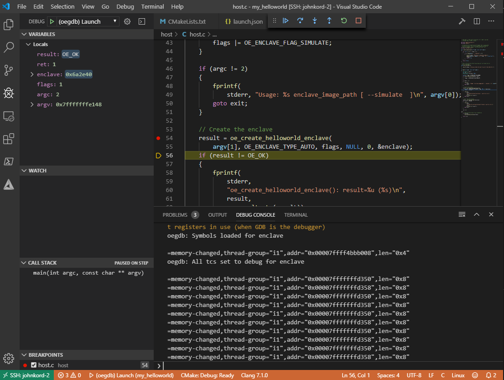

# Building And Debugging Using Visual Studio Code for Linux Development

This document provides a brief overview of how to build and debug Open Enclave applications using VS Code on Linux.

## Install VS Code

The latest version of Visual Studio Code can be installed from [https://code.visualstudio.com/](https://code.visualstudio.com/)

## Install VS Code Extensions

Install the following VS Code extensions. Click on an image to navigate to the Visual Studio Code Marketplace page for the extension.

[](https://marketplace.visualstudio.com/items?itemName=ms-vscode.cpptools)

[](https://marketplace.visualstudio.com/items?itemName=twxs.cmake)

[](https://marketplace.visualstudio.com/items?itemName=vector-of-bool.cmake-tools)

## Launch Visual Studio Code

Launch VS Code either directly on your Linux system, or use the Remote SSH extension to connect your local VS Code instance to another system.

## Configure Your Workspace

1. Ensure all of your dependencies for building an Open Enclave SDK application are installed on your Linux system. You can achieve that by following these instructions: [https://github.com/openenclave/openenclave#getting-started](https://github.com/openenclave/openenclave#getting-started)

2. As an example, on your Linux system, copy one of the samples to your local directory. We will choose the helloworld sample for simplicity.

```bash
cp -R /opt/openenclave/share/openenclave/samples/helloworld ~/my_helloworld
```

3. In VS Code, select `File->Open Folder...` and specify the location that you copied the helloworld sample to. In this case, that would be `~/my_helloworld`

4. Create a typical VSCode project Settings.json file in this path for your project: .vscode/Settings.json. Make sure the `-DCMAKE_PREFIX_PATH` option is set to /opt/openenclave/lib/openenclave/cmake under the "cmake.configureArgs" field, like below:

```json
{
    "cmake.configureArgs": [
        "-DCMAKE_PREFIX_PATH=/opt/openenclave/lib/openenclave/cmake"
    ]
}
```

5. Use the shortcut `Ctrl-Shift-P` and select `CMake: Configure` and choose the kit from the drop down to use, for example, the Clang-8 kit.


## Building and Running an Open Enclave Application

Build the application by pressing F7 or typing "CMake Build a target" in the command palette, and selecting the "all META" target.


Run the application by pressing Shift+F7 or typing "CMake Build a target" in the command palette, and selecting the "run UTILITY" target.


## Configuring Intellisense

Intellisense should work out of the box for files within your workspace. However, Intellisense may not be aware of where to locate the Open Enclave SDK headers.
Open settings.json under the .vscode folder and add entries for "C_Cpp.default.includePath" and "C_Cpp.default.systemIncludePath".

```json
{
    "C_Cpp.default.includePath": ["/opt/openenclave/include"],
    "C_Cpp.default.systemIncludePath": [
        "/opt/openenclave/include/openenclave/3rdparty/libc",
        "/opt/openenclave/include/openenclave/3rdparty/libcxx"
    ]
}
```

## Debugging an Open Enclave Application

To configure VS Code for debugging an enclave app with GDB, go to the Debug tab in the side bar and select the settings cog to open this project's launch.json. Add the `miDebuggerPath` property to indicate where the `oegdb` script is installed. By default, this should be `/opt/openenclave/bin/oegdb`. The `program` and `args` properties should also be set to the location of the sample to debug, for example:

```json
{
    "version": "0.2.0",
    "configurations": [
        {
            "name": "(oegdb) Launch",
            "type": "cppdbg",
            "request": "launch",
            "program": "${workspaceFolder}/build/host/helloworld_host",
            "args": ["${workspaceFolder}/build/enclave/enclave.signed"],
            "stopAtEntry": false,
            "cwd": "${workspaceFolder}",
            "environment": [],
            "externalConsole": false,
            "MIMode": "gdb",
            "miDebuggerPath": "/opt/openenclave/bin/oegdb",
            "setupCommands": [
                {
                    "description": "Enable pretty-printing for gdb",
                    "text": "-enable-pretty-printing",
                    "ignoreFailures": true
                }
            ]
        }
    ]
}
```

Open host.c and add a breakpoint. Start debugging.


Step over the line that creates the enclave. The Console pane should show that the enclave has been loaded.



Open enc.c and put a breakpoint and continue execution.


To step through open enclave code you may need to change the source file mapping to point to the OE SDK source. Add the following to the project launch json under configurations and update with the correct path to the openenclave source:

```json
"sourceFileMap": {
   "/home/jenkins/work_dir/workspace/OpenEnclave-v0.7.x_packages": "/home/username/path2code/openenclave/",
},
```

To use `oegdb` at the command line, one can select the "Debug Console" tab near the terminal pane. Then the standard gdb commands can be used, as long as they are prefixed with `-exec` first, like `-exec bt`. Please read documentation for `gdb` for further information on how to use `oegdb`: [https://sourceware.org/gdb/current/onlinedocs/gdb/](https://sourceware.org/gdb/current/onlinedocs/gdb/)
